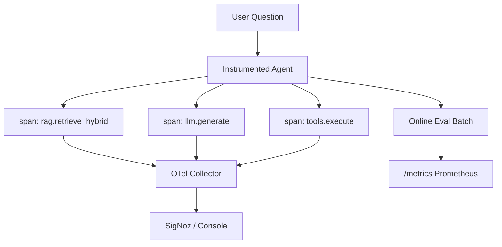

# LLM Observability

**Convergence artifact:** OpenTelemetry traces per RAG + agent step, online LLM-as-judge evals, Prometheus metrics — wired to the [k8s-observability-lab](../k8s-observability-lab/) stack.

## The pitch

> I don't just build LLM apps — I operate and observe them in production.

## Architecture



## Quick start

```bash
cd llm-observability
pip install -r requirements.txt

# Traced ask (console spans)
python src/main.py "Why is ingest spike on web-app-index?"

# Online eval batch + metrics
python src/main.py --eval

# API mode
uvicorn main:app --app-dir src --port 8002
curl -X POST "http://localhost:8002/evals/online?use_mock=true"
curl http://localhost:8002/metrics
```

## Connect to k8s observability lab

```bash
# Terminal 1: lab stack
cd ../k8s-observability-lab/observability  # or project2 observability stack
docker compose up -d

# Terminal 2: export traces
export OTEL_EXPORTER_OTLP_ENDPOINT=http://localhost:4317
python src/main.py --eval
```

View traces in SigNoz (port-forward) or Grafana.

## Spans emitted

| Span | Attributes |
|------|------------|
| `agent.ask` | question |
| `rag.retrieve_hybrid` | hit_count, top_source |
| `llm.generate` | (child of ask) |
| `tools.execute` | tools list |
| `eval.batch` | case_count |
| `eval.case` | case_id, passed, faithfulness |

## Prometheus metrics

| Metric | Description |
|--------|-------------|
| `llm_eval_pass_rate` | Online eval pass rate |
| `llm_eval_faithfulness_mean` | Mean faithfulness |
| `llm_eval_latency_ms_mean` | Mean eval latency |

## Author

**Majid Zandinia** — [GitHub](https://github.com/mzandinia)

## License

MIT
